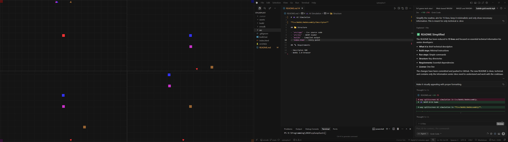

# 🎮 AI Simulation

**C++/WebGL/WebAssembly/Emscripten**



4-way splitscreen AI simulation with real-time rendering and dynamic camera tracking.

## ⚡ Quick Start

**Build:**
```bash
# Install Emscripten SDK in emsdk/
build.bat
```

**Run:**
```bash
python -m http.server 8000
# Open http://localhost:8000
```

## 📁 Structure

- `src/cpp/` - C++ source code
- `src/js/` - WASM loader
- `build/` - Compiled output
- `index.html` - Entry point
- `assets/` - Images and resources

## 🔧 Requirements

- Emscripten SDK
- WebGL 2.0 browser